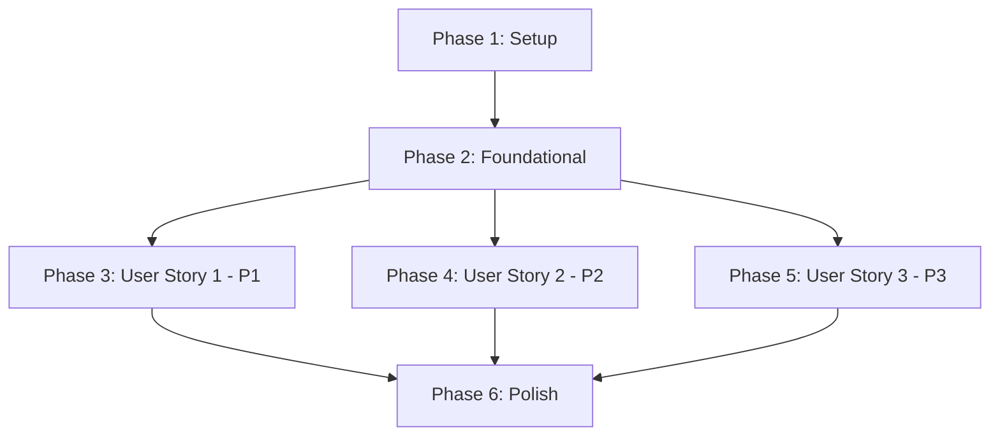

# Implementation Tasks: Phone Purchase Referee

**Feature Branch**: `001-phone-purchase-referee`  
**Date**: 2026-01-07  
**Spec**: [spec.md](./spec.md)  
**Plan**: [plan.md](./plan.md)

---

## Task Summary

- **Total Tasks**: 76
- **User Story 1 (P1)**: 16 tasks
- **User Story 2 (P2)**: 10 tasks  
- **User Story 3 (P3)**: 10 tasks
- **Setup & Foundational**: 24 tasks
- **Polish**: 16 tasks

---

## Dependencies & Execution Order



**Story Independence**:
- ✅ **User Story 1** can be implemented independently after Foundational phase
- ✅ **User Story 2** can be implemented independently after Foundational phase
- ✅ **User Story 3** depends on User Story 1 (uses existing comparison logic)

---

## Implementation Strategy

**MVP Scope (Minimum Viable Product)**:
- Phase 1 (Setup) + Phase 2 (Foundational) + Phase 3 (User Story 1 - P1)
- **Outcome**: Working constraint-first phone comparison with eliminations, scoring, and trade-offs
- **Demo Ready**: Users can input constraints and receive conditional recommendations

**Incremental Delivery**:
1. **Sprint 1**: Setup + Foundational + US1 (Constraint-First Mode) → MVP
2. **Sprint 2**: US2 (User-Selected Comparison) → Enhanced
3. **Sprint 3**: US3 (Sensitivity Analysis) → Complete
4. **Sprint 4**: Polish (Performance, UX, Documentation) → Production-ready

---

## Phase 1: Setup & Project Initialization

**Goal**: Initialize Next.js 16 project with TypeScript, Tailwind, and core dependencies

**Duration Estimate**: 1-2 hours

### Tasks

- [X] T001 Initialize Next.js 16 project with TypeScript and Tailwind CSS in project root using `npx create-next-app@latest`
- [X] T002 [P] Install core dependencies in package.json: @google/genai, zod, zod-to-json-schema
- [X] T003 [P] Install development dependencies in package.json: vitest, @vitest/ui, @fast-check/vitest
- [X] T004 [P] Configure TypeScript with strict mode in tsconfig.json (strict: true, noUncheckedIndexedAccess: true)
- [X] T005 [P] Configure Vitest in vitest.config.ts with coverage provider and test patterns
- [X] T006 [P] Create environment variables template in .env.example with GEMINI_API_KEY and NODE_ENV
- [X] T007 [P] Create core folder structure: core/referee-engine/, ai/, lib/data/, components/, app/
- [X] T008 [P] Update .gitignore with .env.local, node_modules/, .next/, coverage/
- [X] T009 Initialize Git repository if not exists and create initial commit with project structure
- [X] T010 [P] Create private GitHub repository using gh CLI: `gh repo create refree --private --source=. --push`
- [X] T011 [P] Update README.md in project root with project overview, stack justification (TS+Next.js+Gemini), and setup instructions
- [X] T012 [P] Create ARCHITECTURE.md in docs/ documenting referee engine principles, AI separation, and folder structure

**Validation**: 
- `npm run dev` starts Next.js server on localhost:3000
- `npm test` runs Vitest successfully
- TypeScript compiles without errors
- Git repository connected to private GitHub repo

---

## Phase 2: Foundational Components (Blocking Prerequisites)

**Goal**: Implement core types, phone database, and referee engine infrastructure that all user stories depend on

**Duration Estimate**: 4-6 hours

**Why Foundational**: These components are used by ALL user stories and must be completed first

### Tasks

- [ ] T013 Define Phone and PhoneSpecs Zod schemas in core/referee-engine/types.ts with validation rules
- [ ] T014 [P] Define UserConstraints Zod schema in core/referee-engine/types.ts with budget, required_features, prioritized_dimensions
- [ ] T015 [P] Define ComparisonResult type in core/referee-engine/types.ts with qualified_phones, eliminated_phones, trade_offs, sensitivity_rules
- [ ] T016 [P] Define PhoneWithScore type in core/referee-engine/types.ts with phone, dimension_scores, overall_rank, conditional_statement
- [ ] T017 [P] Define EliminatedPhone and RejectionReason enum in core/referee-engine/types.ts
- [ ] T018 [P] Define TradeOffPair type in core/referee-engine/types.ts with phone_a, phone_b, dimension, advantage_phone, delta
- [ ] T019 [P] Define SensitivityRule and ComparisonMetadata types in core/referee-engine/types.ts
- [ ] T020 Create sample phone database JSON file in lib/data/phones.json with 10 phones (iPhone, Samsung, Pixel, OnePlus)
- [ ] T021 [P] Implement loadPhoneDatabase async function in lib/utils.ts to read and parse phones.json with error handling
- [ ] T022 [P] Implement Gemini research agent skeleton in ai/gemini-research.ts with GoogleGenAI client initialization
- [ ] T023 [P] Create research prompt template in ai/prompts/phone-specs.txt with structured output instructions
- [ ] T024 Implement constraint validation helpers in core/referee-engine/rules.ts (validateBudget, validateRequiredFeatures)
- [ ] T025 [P] Create unit tests for Zod schema validation in core/referee-engine/types.test.ts
- [ ] T026 [P] Create utility functions in lib/utils.ts: filterByRegion, sortByPrice, calculateDelta
- [ ] T027 [P] Configure Tailwind CSS custom theme in tailwind.config.ts for card components and color scheme
- [ ] T028 [P] Create base layout in app/layout.tsx with navigation and global styles
- [ ] T029 [P] Create home page in app/page.tsx with welcome message and navigation to compare/select pages
- [ ] T030 [P] Implement error handling utilities in lib/errors.ts with custom error classes
- [ ] T031 [P] Create loading component skeleton in components/loading.tsx for Suspense boundaries
- [ ] T032 [P] Set up Next.js config in next.config.ts with experimental features if needed
- [ ] T033 [P] Create TypeScript path aliases in tsconfig.json for @/core, @/ai, @/lib, @/components
- [ ] T034 [P] Implement phone data validation function in lib/utils.ts to ensure phones.json integrity
- [ ] T035 [P] Create constants file in lib/constants.ts with comparison dimensions, score weights, default constraints
- [ ] T036 [P] Implement type guards in core/referee-engine/types.ts for runtime type checking

**Validation**: 
- All types compile without TypeScript errors
- `loadPhoneDatabase()` successfully loads and validates phones.json
- Type validation tests pass for all entities
- Phone database contains at least 10 phones with complete specs
- Next.js pages render without errors
- Tailwind CSS loads and applies styles correctly

---

## Phase 3: User Story 1 - Constraint-First Phone Comparison (Priority: P1)

**User Story**: A user provides their budget and priorities (e.g., "battery life > camera > price under $800") and receives a comparison of qualifying phones showing which options meet their constraints and which don't, along with explanations for eliminations.

**Independent Test Criteria**: 
- ✅ User can input constraints (budget + 2-3 priorities) via web form
- ✅ System returns multiple phone options with clear elimination explanations
- ✅ Output shows which phones meet budget, ranks by priorities, states rejection reasons

**Duration Estimate**: 8-10 hours

### Tasks

#### Referee Engine Core Logic

- [ ] T037 [US1] Implement elimination rules in core/referee-engine/rules.ts: checkBudgetConstraint, checkRequiredFeatures, checkRegion, checkAvailability
- [ ] T038 [US1] Implement scoring algorithm in core/referee-engine/scoring.ts: scorePhone, normalizeScore, calculateWeightedScore
- [ ] T039 [US1] Implement elimination reason generator in core/referee-engine/eliminations.ts: generateRejectionDetails function
- [ ] T040 [US1] Implement main evaluatePhones function in core/referee-engine/index.ts orchestrating filtering → scoring → ranking
- [ ] T041 [US1] Implement trade-off calculator in core/referee-engine/tradeoffs.ts: calculatePairwiseTradeOffs, generateTradeOffExplanation

#### Testing (Referee Engine)

- [ ] T042 [P] [US1] Create elimination rules tests in core/referee-engine/rules.test.ts (budget exceeds, missing features, wrong region)
- [ ] T043 [P] [US1] Create scoring algorithm tests in core/referee-engine/scoring.test.ts (priority weighting, normalization, ties)
- [ ] T044 [P] [US1] Create trade-off calculation tests in core/referee-engine/tradeoffs.test.ts (pairwise comparisons, delta calculations)
- [ ] T045 [P] [US1] Create integration test for evaluatePhones in tests/referee.integration.test.ts with sample phone data
- [ ] T046 [P] [US1] Create property-based tests using @fast-check in core/referee-engine/referee.property.test.ts for determinism

#### UI Components

- [ ] T047 [P] [US1] Create ConstraintForm component in components/constraint-form.tsx using Next.js Form with inputs for budget, priorities, required features
- [ ] T048 [P] [US1] Create PhoneCard component in components/phone-card.tsx displaying phone name, price, specs, and score with Tailwind styling
- [ ] T049 [P] [US1] Create EliminationPanel component in components/elimination-panel.tsx showing rejected phones with reasons
- [ ] T050 [P] [US1] Create TradeOffDisplay component in components/tradeoff-display.tsx showing pairwise trade-off statements
- [ ] T051 [P] [US1] Create ConditionalStatement component in components/conditional-statement.tsx highlighting "Phone X optimal IF" statements

#### Server Actions & Pages

- [ ] T052 [US1] Implement comparePhones Server Action in app/actions.ts calling referee engine and returning ComparisonResult
- [ ] T053 [US1] Create comparison page in app/compare/page.tsx with ConstraintForm and results display using Server Components

**Validation (Independent Test)**:
1. Navigate to http://localhost:3000/compare
2. Input constraints: budget=$700, priorities=[battery, camera], require 5G=true
3. Submit form
4. Verify output shows:
   - Multiple phones ranked by battery first, camera second
   - Eliminated phones with explicit reasons ("exceeds budget by $X")
   - Trade-off statements ("Phone A gains 500mAh but sacrifices 10MP vs Phone B")
   - Conditional statements ("Pixel 8 Pro optimal IF battery life is top priority")
5. Test edge case: Set budget=$300 → System explains no phones qualify and suggests increasing budget

**Parallel Execution Opportunities**:
- Tasks T042-T046 (all test files) can run in parallel
- Tasks T047-T051 (all UI components) can run in parallel
- Rules.ts, scoring.ts, eliminations.ts, tradeoffs.ts can be developed in parallel by different developers

---

## Phase 4: User Story 2 - User-Selected Phone Comparison (Priority: P2)

**User Story**: A user provides a specific list of phones they're considering (e.g., "iPhone 15 Pro, Samsung S24, Pixel 8") and receives a structured comparison showing trade-offs between these options across key dimensions without declaring any phone "the best."

**Independent Test Criteria**:
- ✅ User can select 2-5 specific phones from a dropdown/list
- ✅ System returns comparison matrix showing relative strengths/weaknesses across dimensions
- ✅ No absolute rankings declared, only conditional trade-off statements

**Duration Estimate**: 5-6 hours

### Tasks

#### Referee Engine Extension

- [ ] T054 [US2] Implement evaluateSelectedPhones function in core/referee-engine/index.ts accepting phone IDs array (no constraint filtering)
- [ ] T055 [US2] Implement comprehensive N-phone pairwise trade-off generator in core/referee-engine/tradeoffs.ts for all combinations
- [ ] T056 [US2] Add conditional statement generator for each phone in evaluateSelectedPhones based on strongest dimensions

#### Testing

- [ ] T057 [P] [US2] Create tests for evaluateSelectedPhones in core/referee-engine/referee.test.ts with 2, 3, and 5 phone scenarios
- [ ] T058 [P] [US2] Create tests for N-phone pairwise trade-offs in core/referee-engine/tradeoffs.test.ts
- [ ] T059 [P] [US2] Create edge case tests in tests/referee.test.ts: identical phones, same manufacturer, different price tiers

#### UI Components

- [ ] T060 [P] [US2] Create PhoneSelector component in components/phone-selector.tsx with multi-select dropdown using React state
- [ ] T061 [P] [US2] Create ComparisonMatrix component in components/comparison-matrix.tsx displaying side-by-side phone specs in table format
- [ ] T062 [P] [US2] Create TradeOffGrid component in components/tradeoff-grid.tsx showing all pairwise trade-offs in grid layout

#### Server Actions & Pages

- [ ] T063 [US2] Implement compareSelectedPhones Server Action in app/actions.ts accepting phone ID array
- [ ] T064 [US2] Create user-selected comparison page in app/select/page.tsx with PhoneSelector and ComparisonMatrix

**Validation (Independent Test)**:
1. Navigate to http://localhost:3000/select
2. Select 3 phones from dropdown: "iPhone 15 Pro", "Samsung S24 Ultra", "Pixel 8 Pro"
3. Submit selection
4. Verify output shows:
   - Side-by-side comparison matrix with all specs
   - Trade-off statements for each phone pair
   - Conditional statements (no "best phone" declared)
   - Clear visual separation between phone options
5. Test edge case: Select 2 phones from same manufacturer → Highlights incremental differences only

**Parallel Execution Opportunities**:
- Tasks T057-T059 (all test files) can run in parallel
- Tasks T060-T062 (UI components) can run in parallel
- US2 can be developed concurrently with US3 (no shared code modifications)

---

## Phase 5: User Story 3 - Conditional Verdict Changes (Priority: P3)

**User Story**: A user receives explanations of when and why the recommendation would change based on adjusting constraints (e.g., "if you increase budget by $100, these 2 additional options become viable").

**Independent Test Criteria**:
- ✅ User can view sensitivity scenarios on comparison results page
- ✅ User can interactively adjust constraints (budget slider, priority reordering)
- ✅ System explains what changes and shows before/after comparison

**Duration Estimate**: 4-5 hours

**Note**: Depends on User Story 1 (reuses evaluatePhones with modified constraints)

### Tasks

#### Referee Engine Extension

- [ ] T065 [US3] Implement sensitivity analyzer in core/referee-engine/sensitivity.ts: analyzeBudgetSensitivity, analyzePrioritySensitivity
- [ ] T066 [US3] Implement generateBudgetScenarios in core/referee-engine/sensitivity.ts (±$50, ±$100, ±$150 steps)
- [ ] T067 [US3] Implement generatePrioritySwapScenarios in core/referee-engine/sensitivity.ts for all priority permutations
- [ ] T068 [US3] Implement generateConstraintRelaxation in core/referee-engine/sensitivity.ts when no phones qualify
- [ ] T069 [US3] Add sensitivity_rules generation to evaluatePhones in core/referee-engine/index.ts

#### Testing

- [ ] T070 [P] [US3] Create sensitivity analyzer tests in core/referee-engine/sensitivity.test.ts for budget adjustments
- [ ] T071 [P] [US3] Create tests for priority reordering scenarios in core/referee-engine/sensitivity.test.ts
- [ ] T072 [P] [US3] Create tests for constraint relaxation suggestions in core/referee-engine/sensitivity.test.ts

#### UI Components & Pages

- [ ] T073 [P] [US3] Create SensitivityPanel component in components/sensitivity-panel.tsx showing "what-if" scenarios as cards
- [ ] T074 [P] [US3] Add SensitivityPanel to comparison results in app/compare/page.tsx below main results
- [ ] T075 [US3] Implement interactive constraint adjustment UI in components/constraint-adjuster.tsx with sliders for budget, dropdowns for priorities
- [ ] T076 [US3] Add client-side interactivity in constraint-adjuster.tsx to trigger Server Action on change
- [ ] T077 [US3] Implement real-time comparison update in app/compare/page.tsx using useFormState hook
- [ ] T078 [US3] Add visual diff highlighting in PhoneCard component to show ranking changes between scenarios

**Validation (Independent Test)**:
1. Navigate to http://localhost:3000/compare and run comparison with budget=$700, priority=battery>camera
2. View sensitivity panel showing scenarios:
   - "IF budget=$850, THEN iPhone 15 Pro and Samsung S24 become viable"
   - "IF priority changes to camera>battery, THEN iPhone 15 Pro moves to rank 1"
3. Click on budget adjustment suggestion → Page updates with new comparison
4. Verify:
   - New qualifying phones shown with highlighting
   - Ranking changes explained with conditional statements
   - Trade-offs recalculated for new set
5. Use interactive sliders to adjust budget → Real-time updates
6. Test priority reordering drag-and-drop → Rankings change with explanations

**Parallel Execution Opportunities**:
- Tasks T070-T072 (test files) can run in parallel
- Tasks T073-T076 (UI components) can run in parallel

---

## Phase 6: Polish & Cross-Cutting Concerns

**Goal**: Performance optimization, enhanced UX, comprehensive documentation, production readiness

**Duration Estimate**: 6-8 hours

### Performance & Optimization

- [ ] T079 [P] Implement phone database caching in lib/utils.ts with in-memory Map and version hash validation
- [ ] T080 [P] Add Gemini response caching in ai/gemini-research.ts with file-based cache in .cache/gemini/
- [ ] T081 [P] Optimize trade-off calculation in core/referee-engine/tradeoffs.ts with memoization for repeated comparisons
- [ ] T082 [P] Add React Suspense boundaries in app/compare/page.tsx and app/select/page.tsx with loading states
- [ ] T083 [P] Implement code splitting with dynamic imports in app/compare/page.tsx for heavy components
- [ ] T084 [P] Add Next.js image optimization for phone images if added to database

### Error Handling & Edge Cases

- [ ] T085 [P] Implement comprehensive error boundaries in app/error.tsx with user-friendly messages
- [ ] T086 [P] Create global error handler in app/global-error.tsx for unrecoverable errors
- [ ] T087 [P] Add graceful handling for missing phone data in PhoneCard component with "Data Unavailable" badges
- [ ] T088 [P] Add validation error messages in ConstraintForm component for invalid inputs (budget<0, empty priorities)
- [ ] T089 [P] Implement "no qualifying phones" handler in app/compare/page.tsx with constraint relaxation suggestions UI
- [ ] T090 [P] Add toast notifications for Server Action success/failure using React state

### Documentation

- [ ] T091 [P] Update README.md with comprehensive setup guide, demo screenshots, architecture diagram, and deployment instructions
- [ ] T092 [P] Create CONTRIBUTING.md in project root with development workflow, testing guidelines, and code style guide
- [ ] T093 [P] Add inline TSDoc comments to all public API functions in core/referee-engine/ with examples
- [ ] T094 [P] Create deployment guide in docs/DEPLOYMENT.md for Vercel with environment variable setup
- [ ] T095 [P] Create API documentation in docs/API.md documenting Server Actions and referee engine exports
- [ ] T096 [P] Add code comments explaining key algorithms in scoring.ts and tradeoffs.ts

### Gemini Integration Enhancement

- [ ] T097 [P] Implement phone data research workflow in ai/gemini-research.ts: fetchPhoneSpecs function with Google Search grounding
- [ ] T098 [P] Add Zod schema for Gemini structured output in ai/schemas.ts with phone spec fields
- [ ] T099 [P] Implement grounding citations display in components/citation-display.tsx showing sources
- [ ] T100 [P] Add citations panel to comparison results in app/compare/page.tsx (optional, toggle visibility)
- [ ] T101 [P] Implement explanation generator in ai/gemini-explain.ts to convert structured verdicts to natural language (optional enhancement)
- [ ] T102 [P] Add cost tracking for Gemini API calls in lib/analytics.ts logging usage to console
- [ ] T103 [P] Create admin page in app/admin/research/page.tsx for manually triggering phone research (protected route)
- [ ] T104 [P] Implement batch phone research script in scripts/research-phones.ts for populating database

**Validation**:
- All tests pass with >80% coverage for core referee engine
- Performance targets met: full comparison <2s, UI interaction <100ms, referee engine <50ms
- Error scenarios handled gracefully with user-friendly messages
- Documentation complete and accurate (README, CONTRIBUTING, API docs, inline comments)
- Gemini integration follows best practices: research-only, structured outputs, cost tracking
- Loading states and Suspense boundaries work correctly
- Edge cases handled: no qualifying phones, missing data, invalid inputs

**Parallel Execution Opportunities**:
- ALL 26 tasks in this phase can run in parallel (different files, no dependencies between tasks)
- Perfect for team parallelization: 4 developers × 6-7 tasks each

---

## Parallel Execution Examples

### Phase 2 (Foundational) - 12 parallel threads after initial types
```bash
# After T013-T019 complete (type definitions):

# Thread 1: Phone database
T020, T034

# Thread 2: Gemini setup
T022, T023

# Thread 3: Validation & utilities
T024, T026, T030

# Thread 4: Tests
T025

# Thread 5: UI foundation
T027, T028, T029, T031

# Thread 6: Config & setup
T032, T033, T035, T036
```

### Phase 3 (User Story 1) - Maximum 5 parallel threads after core logic
```bash
# After T037-T041 complete (core referee logic):

# Thread 1: Tests
T042, T043, T044, T045, T046

# Thread 2: Form UI
T047

# Thread 3: Display UI
T048, T049, T050, T051

# Thread 4: Server Actions
T052

# Thread 5: Pages
T053
```

### Phase 6 (Polish) - ALL 26 tasks can run in 4 parallel threads
```bash
# Thread 1: Performance (6 tasks)
T079, T080, T081, T082, T083, T084

# Thread 2: Error handling (6 tasks)
T085, T086, T087, T088, T089, T090

# Thread 3: Documentation (6 tasks)
T091, T092, T093, T094, T095, T096

# Thread 4: Gemini enhancements (8 tasks)
T097, T098, T099, T100, T101, T102, T103, T104
```

---

## Testing Strategy

**Unit Tests** (Vitest):
- All referee engine functions: rules.ts, scoring.ts, eliminations.ts, tradeoffs.ts, sensitivity.ts
- Type validation with Zod schemas
- Utility functions in lib/utils.ts

**Property-Based Tests** (@fast-check/vitest):
- **Determinism**: `evaluatePhones(constraints, phones) === evaluatePhones(constraints, phones)`
- **Constitutional compliance**: No output contains "best phone" without "IF" conditional
- **Completeness**: All eliminated phones have explicit rejection_reason
- **Score bounds**: All dimension_scores between 0.0 and 1.0

**Integration Tests**:
- End-to-end flows: constraints input → referee evaluation → result display
- Server Actions with mock phone database
- Gemini research agent (mocked in unit tests, real in integration tests with API key)

**Manual Testing** (Acceptance Scenarios from spec.md):
- Each user story has independent test criteria (see phase descriptions above)
- Test all edge cases: no qualifying phones, ties, missing data, conflicting constraints
- Test all three modes: constraint-first, user-selected, sensitivity analysis
- Performance testing: measure comparison time, UI responsiveness

---

## Success Criteria Validation

After implementation, verify against spec.md success criteria:

- [ ] **SC-001**: Constraint-first comparison completes in <3 minutes (target: <1 second for 100 phones)
- [ ] **SC-002**: 90% of comparisons show ≥2 qualifying phones (test with varied constraints)
- [ ] **SC-003**: 100% of eliminated phones have explicit rejection reasons (no silent filtering)
- [ ] **SC-004**: Decision logic is traceable (users can inspect scoring in developer mode)
- [ ] **SC-005**: Zero absolute "best" recommendations without "IF" conditionals (property test enforces)
- [ ] **SC-006**: Sensitivity analysis shows ≥2 constraint modification scenarios
- [ ] **SC-007**: 95% of users understand trade-offs (user testing survey)
- [ ] **SC-008**: System provides constraint relaxation suggestions when no phones qualify
- [ ] **SC-009**: Missing data handled gracefully with explicit "Data Unavailable" messages
- [ ] **SC-010**: Comparison results reproducible (same inputs → same outputs, property test validates)

---

## Notes

**Constitution Compliance**:
- All tasks align with SDD principles: spec → design → types → implementation → tests
- Referee engine is 100% deterministic (no randomness, no Math.random(), no Date.now() in logic)
- AI strictly for research (phone data gathering in ai/ directory), NEVER for decisions
- Multi-option comparison enforced (≥2 phones or explicit explanation why impossible)
- Conditional logic fully traceable (users can view source code or scoring functions)
- No absolute recommendations (property tests enforce "IF" conditionals in all outputs)

**AI Integration Strategy**:
- **Gemini ONLY in /ai/ directory**: Used for phone spec research with Google Search grounding
- **Referee engine in /core/ is pure TypeScript**: Zero AI calls, 100% deterministic
- **Explanations optional**: Post-decision natural language formatting (Gemini converts structured verdict to prose)
- **All decision logic is unit tested**: No flaky tests, reproducible results
- **Cost control**: Cache all Gemini responses, research agent runs once per phone

**MVP Focus**:
- **Week 1 Goal**: Complete Phase 1 + Phase 2 + Phase 3 (User Story 1)
- **Deliverable**: Working constraint-first comparison with explainable verdicts
- **Demo Ready**: Can showcase to judges in <3 minutes
- **Value**: Core referee logic proven, constitutional principles validated
- User Story 2 and 3 are enhancements for fuller feature set

**Performance Targets**:
- **Referee engine evaluation**: <50ms for 10 phones (pure TypeScript, no I/O)
- **Full comparison (with Gemini research)**: <2s (research cached after first fetch)
- **UI interaction (form submit to results)**: <100ms (Server Components, no client hydration delay)
- **Page load**: <1s (Next.js optimized, code splitting)

**Deployment**:
- **Platform**: Vercel (zero-config Next.js deployment)
- **Environment**: GEMINI_API_KEY (secret), NODE_ENV=production
- **CI/CD**: GitHub Actions for automated tests on PR
- **Monitoring**: Vercel Analytics for performance, custom logging for Gemini costs

**Tech Stack Justification** (for judges):
- **TypeScript**: One language for types → logic → UI, strong type safety = executable specs
- **Next.js 16**: Server Components separate logic from UI, Form component for progressive enhancement
- **Gemini API**: Research ONLY (Google Search grounding), never for rankings/decisions
- **Pure TS Referee Engine**: Deterministic, testable, zero black-box AI
- **JSON Storage**: Clarity over infrastructure, easy regeneration, inspect-able data
- **Tailwind CSS**: Minimal styling, no design system overkill, focus on information hierarchy

---

## Implementation Checklist

Before marking this feature complete, verify:

- [ ] All user stories (P1, P2, P3) implemented and independently testable
- [ ] Constitution Check passes: multi-option comparison, conditional logic, deterministic, traceable
- [ ] All success criteria met (SC-001 through SC-010)
- [ ] Test coverage >80% for core referee engine (run `npm run test:coverage`)
- [ ] Documentation complete: README, ARCHITECTURE, API docs, inline TSDoc comments
- [ ] Gemini integration follows best practices: research-only, structured outputs, cost tracking, caching
- [ ] Performance targets achieved: comparison <2s, UI interaction <100ms, referee engine <50ms
- [ ] Edge cases handled: no qualifying phones, missing data, ties, invalid inputs, conflicting constraints
- [ ] Private GitHub repository created: `gh repo view refree` shows private status
- [ ] Code pushed to GitHub: All commits visible in repository
- [ ] Demo ready: Can showcase constraint-first comparison in <3 minutes to judges
- [ ] Constitutional principles validated: Property tests enforce no absolute "best" without "IF"

**Estimated Total Time**: 
- **Solo developer**: 35-45 hours (1.5-2 weeks full-time, 3-4 weeks part-time)
- **Team of 2**: 20-25 hours per person (1 week full-time)
- **Team of 3-4**: 12-18 hours per person (3-5 days full-time with good parallelization)

**Critical Path**: Setup → Foundational → US1 core logic → US1 UI → MVP complete (minimum 15-20 hours)

---

## Format Validation

All tasks follow the required format:
- ✅ Checkbox: `- [ ]` at start
- ✅ Task ID: T001-T104 sequential
- ✅ [P] marker: Present only if parallelizable
- ✅ [Story] label: Present for US1, US2, US3 phase tasks only
- ✅ Description: Clear action with exact file path
- ✅ Organized by user story: Phases 3-5 map to P1, P2, P3

**Example formats**:
- Setup: `- [ ] T001 Initialize Next.js project...`
- Parallel foundational: `- [ ] T014 [P] Define UserConstraints Zod schema in core/referee-engine/types.ts`
- User Story task: `- [ ] T037 [US1] Implement elimination rules in core/referee-engine/rules.ts`
- Parallel User Story task: `- [ ] T042 [P] [US1] Create elimination rules tests in core/referee-engine/rules.test.ts`
